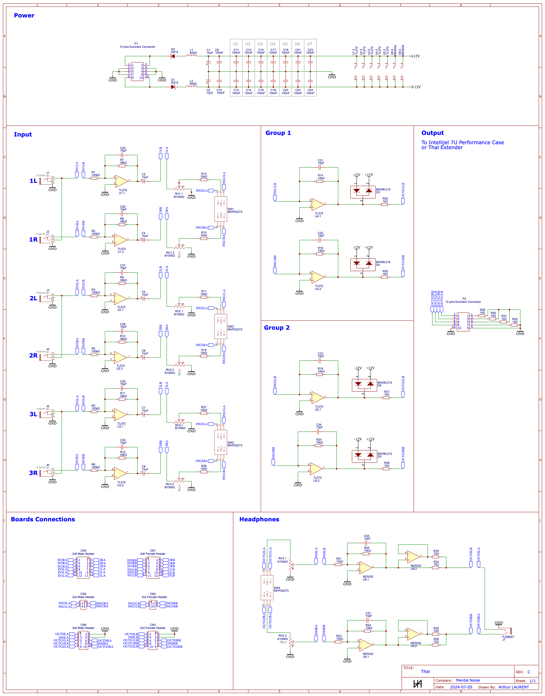

# Thal

Thal is an open source mixer / output Eurorack module tailored for the Intellijel Performance Cases (extender available for other Eurorack cases).

## Details

You can see Thal as a mix of 3 modules:
- Befaco STMix
- Befaco Out
- Intellijel Audio I/O

Key features:
- 3 channels mono/stereo mixer
- Each channel can be sent to 1 of 2 groups
- Headphones output which can listen to 1 of 2 groups
- 1 stereo output for each group using Intellijel Performance Cases' input/output 1/4" jacks
- High quality audio capacitors for a clean and bright output (Nichicon Muse ES, bipolar electrolytic)
- Logarithmic pot for the headphones output

An extender is also available to output the stereo groups if you don't have a compatible case.

## Where to buy

The module will soon be available on [my Tindie store](https://www.tindie.com/stores/mentalnoise/).

## Schematics

All schematics can be found in the [schematics folder](./schematics).

To import the schematics:
- Install EasyEDA at https://easyeda.com/ and download the standard edition
- Import [schematics.json](./schematics/schematics.json) in EasyEDA editor by clicking the document icon on the topbar, "Document" > "Open" > "EasyEDA Source", and select the json file

